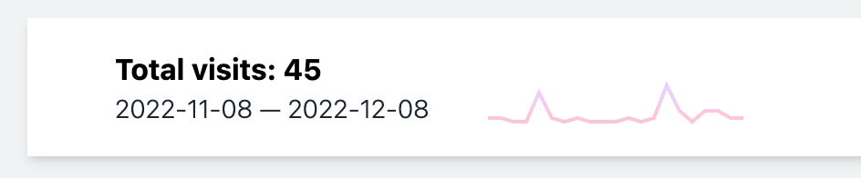
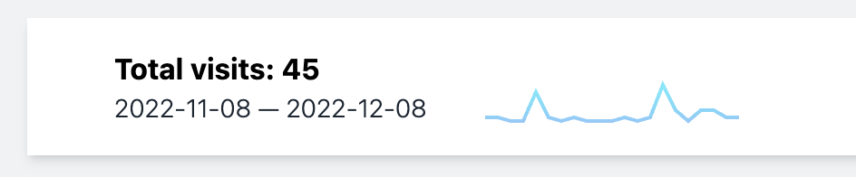
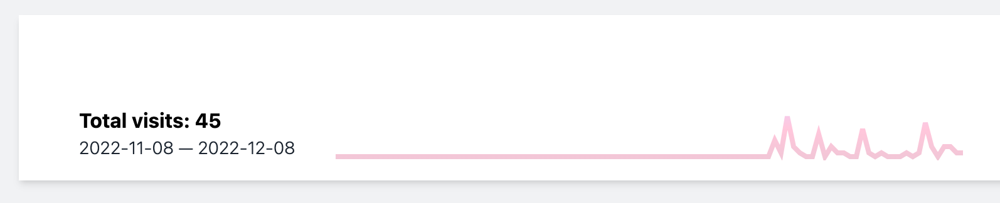

# Generate sparkline SVGs in PHP

[](https://packagist.org/packages/brendt/php-sparkline)
[](https://github.com/brendt/php-sparkline/actions/workflows/run-tests.yml)
[](https://packagist.org/packages/brendt/php-sparkline)

PHP-Sparkline generates GitHub style sparkline graphs. Read this guide to know how to use it.

## Installation

You can install the package via composer:

```bash
composer require brendt/php-sparkline
```

## Usage

```php
$sparkLine = new SparkLine(1, 2, 5, 10, 2));

$total = $sparkLine->getTotal();

$svg = $sparkLine->make();
```



To construct a sparkline, you'll have to pass in an array of values.

### Customization

You can pick any amount of colors and the sparkline will automatically generate a gradient from them:

```php
$sparkLine = (new SparkLine($days))->withColors('#4285F4', '#31ACF2', '#2BC9F4');
```



You can configure the stroke width:

```php
$sparkLine = (new SparkLine($days))->withStrokeWidth(4);
```

As well as the dimensions (in pixels):

```php
$sparkLine = SparkLine::new($days)->withDimensions(width: 500, height: 100);
```



## Testing

```bash
composer test
```

## Changelog

Please see [CHANGELOG](CHANGELOG.md) for more information on what has changed recently.

## Security Vulnerabilities

Please review [our security policy](../../security/policy) on how to report security vulnerabilities.

## Credits

- [Brent Roose](https://github.com/brendt)
- [All Contributors](../../contributors)

## License

The MIT License (MIT). Please see [License File](LICENSE.md) for more information.
